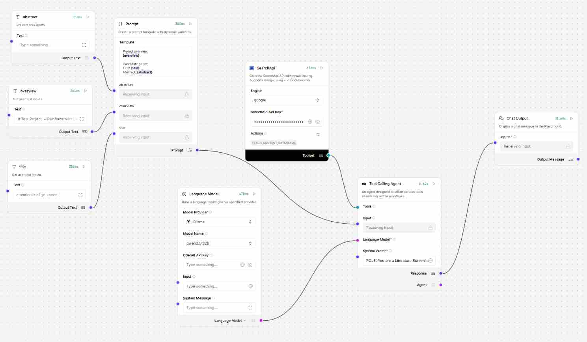
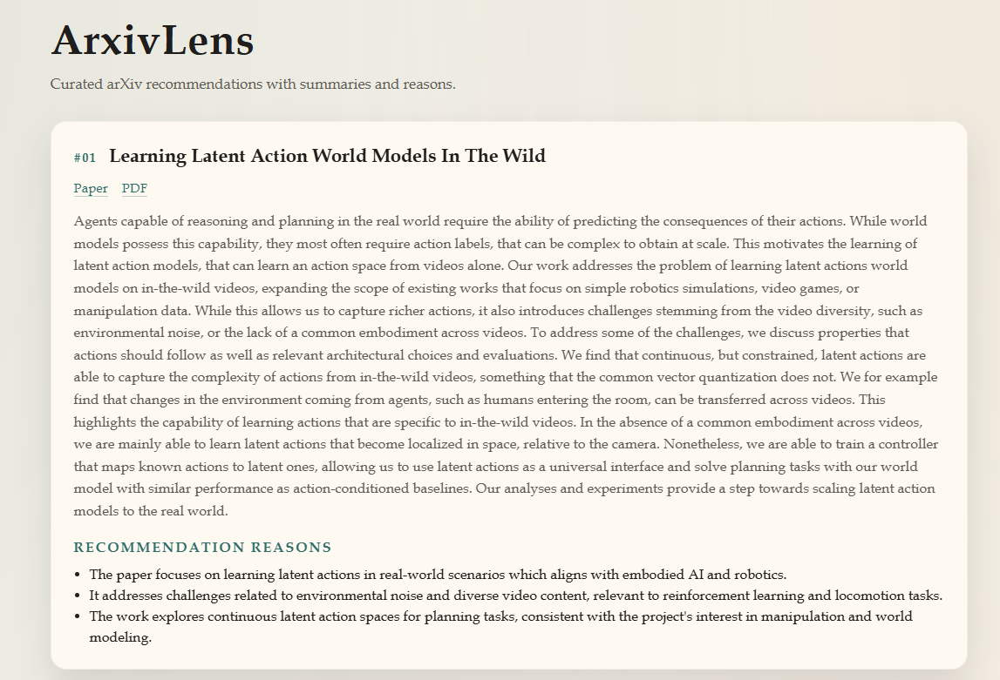

# Overview -> Embedding -> LLM Rerank Demo (CLI)

This repo root contains a minimal demo pipeline extracted from `zotero-arxiv-daily`:

1) Read `overview.md` as project context
2) Fetch arXiv candidates (title + abstract)
3) Embedding rerank via `utils.recommender.rerank_paper`
4) Optional LLM rerank via Ollama (JSON output) or Langflow (JSON output)
5) Print Top-N to terminal

## Quick Run
### Run with Langchain Backend:
```bash
python main.py --overview_path data/overview.md --arxiv_query cs.AI+cs.CV+cs.LG+cs.CL --top_retrieve 10 --enable_llm_rerank true --llm_rerank_backend langchain
```
### Run with Langflow Backend:
```bash
python main.py --overview_path data/overview.md --arxiv_query cs.AI+cs.CV+cs.LG+cs.CL --top_retrieve 10 --enable_llm_rerank true --llm_rerank_backend langflow --langflow_mode local --langflow_flow_id d6280b6b-4d2a-497d-bcbb-9116ca0ba041 --langflow_api_key sk-TpmyAx3mIMmiivJ2tZulONiCg309yMKt91lmlm7XIF4 --langflow_flow_path data/ollama_rerank_agent.json
```

Langflow LLM rerank option:
1) Open Langflow UI and import `llm_rerank_flow.json`
2) Set the Language Model provider to Ollama (or your choice)
3) Copy the flow ID and API key

## Backends
### Ollama Backend
#### Ollama LLM Rerank Prompt
```plaintext
{
    "role": "user",
    "content": (
        "Your previous response was invalid or not JSON. "
        "Return ONLY valid JSON with the required keys, no markdown."
    ),
}
```
### Langflow Backend
#### Langflow flow graph

#### Langflow LLM Rerank Prompt
[See prompts for details](docs/prompt.md)

## Ouptput Example
### CLI Output in terminal:
```plaintext
1. final=0.742 embed=7.857 llm=8.0
   published: 2026-01-08 | categories: cs.AI, cs.CV
   title: Learning Latent Action World Models In The Wild
   url: http://arxiv.org/abs/2601.05230v1
   pdf: https://arxiv.org/pdf/2601.05230v1
   reason 1: The paper focuses on learning latent actions in real-world scenarios which aligns with embodied AI and robotics.
   reason 2: It addresses challenges related to environmental noise and diverse video content, relevant to reinforcement learning and locomotion tasks.
   action: shortlist
...
```
### Webpage Output
After running, the terminal will print a local server address:



## CLI Arguments

- `--overview_path` (default `overview.md`)
- `--arxiv_query` (default from `ARXIV_QUERY`)
- `--top_retrieve` (default `50`)
- `--enable_llm_rerank` (default `true`)
- `--llm_rerank_backend` (`ollama`, `langflow`, or `langchain`, default `ollama`)
- `--ollama_base_url` (default `http://localhost:11434`)
- `--ollama_model` (default `qwen2.5:14b`)
- `--langflow_base_url` (default `http://localhost:7863`)
- `--langflow_mode` (`http` or `local`, default `local`)
- `--langflow_flow_id` (required for langflow rerank)
- `--langflow_flow_path` (flow JSON path for `langflow_mode=local`, default `data/llm_rerank_flow.json`)
- `--langflow_api_key` (optional)
- `--seed` (optional)
- `--debug`

Notes:
- Langflow rerank expects the `arxiv` conda environment.
- LangChain rerank expects the `lc` conda environment.
- LangChain rerank uses SearchApi; set `SEARCHAPI_API_KEY` (or `SEARCHAPI_KEY`) for tool calls.

## API Notes

### main.py
- Orchestrates the demo flow.
- Scoring:
  - Embed scores normalized to [0,1] over `top_retrieve`.
  - If LLM rerank enabled: `final = 0.6 * norm_embed + 0.4 * (fit_score / 10)`.
  - If LLM rerank disabled: `final = norm_embed`.
  - When LLM rerank enabled, only `relevant=true` papers are kept.

### utils/arxiv_fetcher.py
- `get_arxiv_paper(query, days=7, max_candidates=150, debug=False) -> list[ArxivPaper]`
- Uses RSS to collect IDs, then fetches metadata in batches of 20.
- Filters by `days` using published time (UTC).

### utils/recommender.py
- `rerank_paper(candidate, corpus, model="avsolatorio/GIST-small-Embedding-v0")`
- `corpus` must be:
  ```python
  [{"data": {"abstractNote": "...", "dateAdded": "YYYY-MM-DDTHH:MM:SSZ"}}]
  ```
- Produces `paper.score` and returns sorted list.

### utils/paper.py
- `ArxivPaper` wrapper fields:
  - `title`, `summary`, `authors`, `arxiv_id`, `url`, `categories`
  - `published`, `published_date`, `pdf_url`
  - scoring/LLM rerank fields: `score`, `final_score`, `llm_rerank_relevant`, `llm_rerank_fit_score`, `llm_rerank_reasons`, `llm_rerank_action`, `llm_rerank_failed`

### backend/ollama_client.py
- `chat_json(model, system, user, base_url="http://localhost:11434", timeout=90, retries=2) -> dict`
- Enforces JSON-only output; retries if invalid JSON.

### backend/langflow_client.py
- `langflow_rerank_json_local(overview, title, abstract, flow_path, retries=1) -> dict`
- `langflow_rerank_json_http(flow_id, overview, title, abstract, base_url="http://localhost:7863", api_key=None, timeout=90, retries=1) -> dict`
- `llm_rerank_json(flow_id, overview, title, abstract, base_url="http://localhost:7863", api_key=None, timeout=90, retries=1, mode="local", flow_path=None) -> dict`
- Runs a Langflow flow and extracts JSON output.

### backend/llm_rerank.py
- `ollama_llm_rerank(overview_text, papers, model, base_url, timeout=90, retries=1)`
- `langflow_llm_rerank(overview_text, papers, flow_id, base_url, api_key=None, timeout=90, retries=1, mode="local", flow_path=None)`
- Expects JSON:
  ```json
  {"relevant": true, "fit_score": 0-10, "reasons": ["..."], "action": "..."}
  ```
- Normalizes values and attaches to each paper.
-- `--debug`
